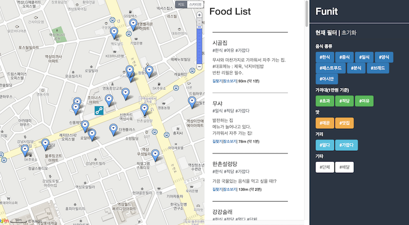
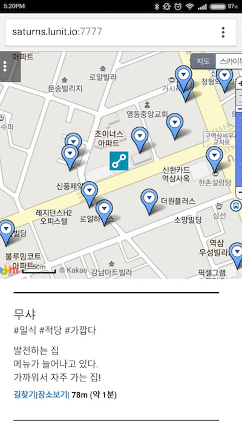
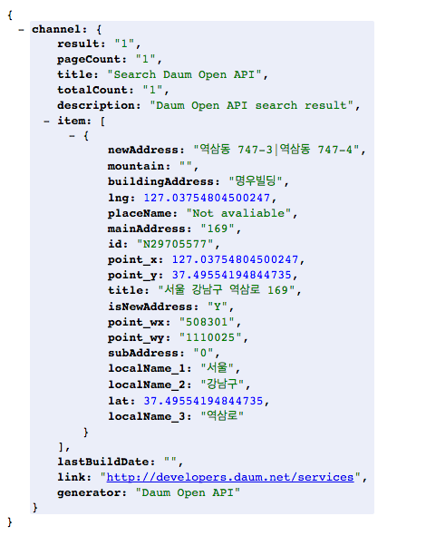

# Funit
Food Unit

밥 뭐먹지를 해결하기 위한 프로젝트.  
[Funit Web App Link](http://saturns.lunit.io:7777/)

**Base Project** : [Somat](https://github.com/swmaestro/somat)

## Web App

### Web

### Mobile

## Data

[Admin Page](http://saturns.lunit.io:7777/admin/)
에서 Data Add.  

### data description

- Name : 음식점이름
- X : 위도
- Y : 경도
- Content : 음식점에 대한 소개 및 코멘트
- Tag : 관련 태그

### 위도,경도 얻는 방법

다음지도 API 사용.
https://apis.daum.net/local/geo/addr2coord?{api_key}&output=json&q={음식점 주소}

여기서 

> X = point_x 값.
> Y = point_y 값.

**예시화면**

## Tags

### 현재 사용가능한 tag

- 음식종류: #한식 #중식 #일식 #양식 #패스트푸드 #분식 #브래드 #아시안  
- 가격대(1만원 기준): #초과 #적당 #여유
- 맛 : #매운 #맛집
- 거리 : #멀다 #가깝다
- 기타 : #단체 #배달